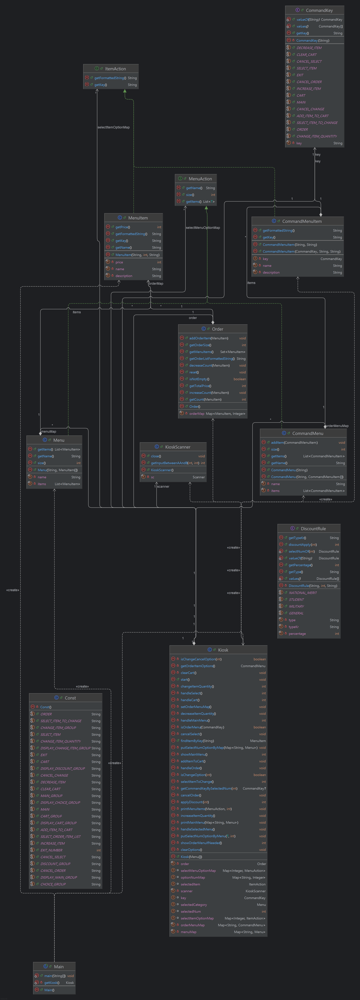

# CH 2: 키오스크 과제

## 단계별 목표
`필수 기능`
- Lv 1: 기본적인 키오스크를 프로그래밍해보자
- Lv 2: 객체 지향 설계를 적용해 햄버거 메뉴를 클래스로 관리하기
- Lv 3: 객체 지향 설계를 적용해 순서 제어를 클래스로 관리하기
- Lv 4: 객체 지향 설계를 적용해 음식 메뉴와 주문 내역을 클래스 기반으로 관리하기
- Lv 5: 캡슐화 적용하기

`도전 기능`
- Lv 1: 장바구니 및 구매하기 기능을 추가하기
- Lv 2: Enum, 람다 & 스트림을 활용한 주문 및 장바구니 관리

## 파일 구조
```bash
src
├──── kiosk
│  ├──── constants
│  │  ├──── CommandKey.java
│  │  └──── Const.java
│  ├──── rule
│  │  └──── DiscountRule.java
│  ├──── util
│  │  └──── KioskScanner.java
│  └──── Kiosk.java
├──── main
│  └──── Main.java
├──── menu
│  ├──── command
│  │  ├──── CommandMenu.java
│  │  └──── CommandMenuItem.java
│  ├──── product
│  │  ├──── Menu.java
│  │  └──── MenuItem.java
│  └──── type 
│     ├──── ItemAction.java
│     └──── MenuAction.java
├──── order
│     └──── Order.java
└──── README.md
```

## 과제 진행 요약
- 요구사항 정의
  - [요구사항 정의](https://gajicoding.tistory.com/250)
- 문제 해결 (트러블 슈팅)
  - [List.of()로 만든 리스트에서 add()가 안 되는 이유](https://gajicoding.tistory.com/261)
- 새로운 지식
  - [가변 인자 (...)](https://gajicoding.tistory.com/247)
  - [Map - compute(), computeIfAbsent(), computeIfPresent()](https://gajicoding.tistory.com/248)
  - [가변 리스트 vs 불변 리스트](https://gajicoding.tistory.com/249)


- UML <br/><br/>
  